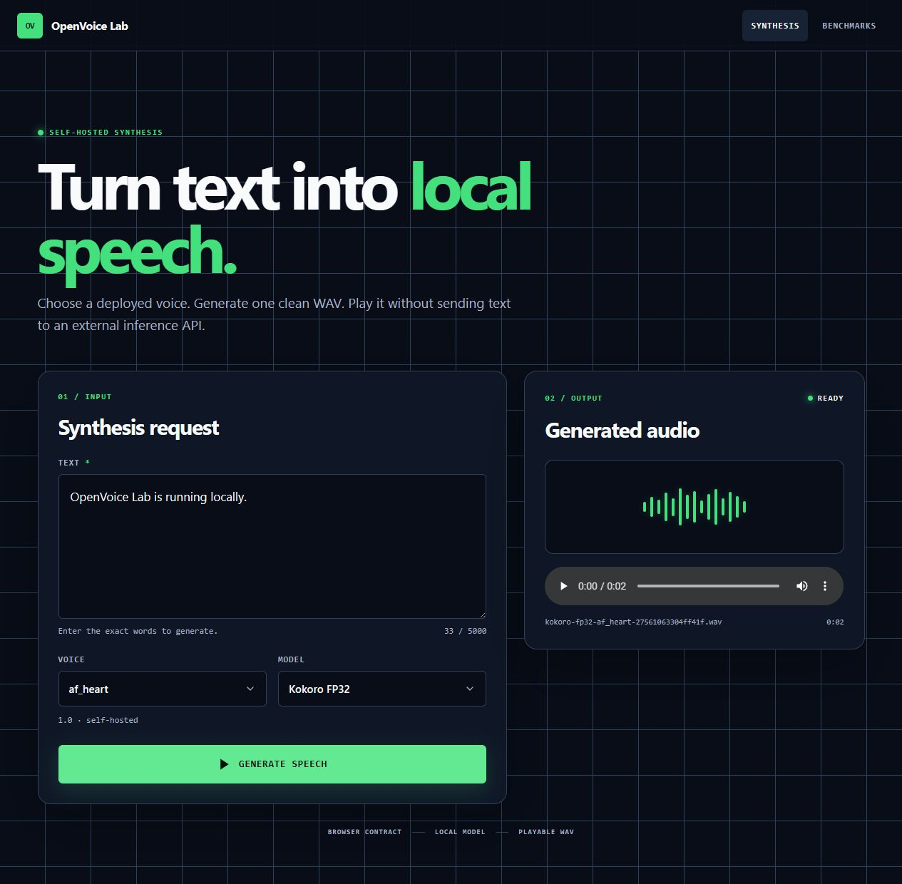

# OpenVoice Lab

**Own the stack. Measure the result.**

OpenVoice Lab evaluates and serves open-weight TTS models through a modular
Angular + FastAPI architecture.

This README is a cumulative build record. New stages extend the story; completed
stages stay visible as evidence of how the system evolved.

## Stage 0 — Architecture-first repository

> “I designed a modular architecture for evaluating and deploying open-weight
> TTS models before implementing the inference system.”

**Responsibility:** establish boundaries before writing inference code.

```text
Angular → REST → FastAPI → SynthesisService → Inference abstraction → Kokoro
```

Stage 0 established the Angular/FastAPI split, replaceable inference port, API
contracts, model-lifecycle ownership, benchmark boundaries, and documentation
conventions. The repository initialized cleanly with every planned module
documented and no runtime claims.

**Portfolio proof:** software architecture and API design.

## Stage 1 — Executable backend contract

> “I converted the architecture into a working FastAPI service while keeping
> inference implementation replaceable.”

**Responsibility:** prove the API boundary before adding AI complexity.

```text
HTTP → FastAPI controller → Pydantic validation → service → typed JSON
```

Stage 1 made `GET /health`, `GET /api/models`, and `POST /api/synthesis`
executable. Synthesis returned deterministic mock data while controllers stayed
limited to HTTP translation, validated schemas, and service calls. Automated
tests covered health, models, valid synthesis, and malformed-input `422` errors.

**Portfolio proof:** FastAPI, Pydantic, API contracts, and service separation.

## Stage 2 — First real open-weight synthesis

> “I replaced the mock implementation with locally hosted open-weight TTS
> inference without changing the API contract.”

| | |
| --- | --- |
| **Model** | Kokoro v1.0 FP32 |
| **Runtime** | ONNX Runtime on the local CPU |
| **Hosting** | Self-hosted |
| **External inference APIs** | None |
| **Current proof** | Text becomes a playable, locally served 24 kHz WAV. |

```text
POST /api/synthesis
  ↓
SynthesisService
  ↓
ModelRegistry → ModelLoader (load once)
  ↓
TTSInferenceEngine
  ↓
KokoroONNXEngine
  ↓
AudioService → generated WAV
```

Controllers still know nothing about Kokoro or ONNX. `ModelLoader` owns the
long-lived runtime session. Repeated identical requests reuse both the loaded
model and a stable request-addressed artifact.

## Stage 3 — Complete synthesis vertical slice

> “I built the first complete user-facing path from Angular input to locally
> hosted AI inference and audio playback.”

**Responsibility:** connect the product path without leaking backend technology
into the browser.

```text
Angular → FastAPI → Kokoro → Audio → Angular player
```

Stage 3 loads model and voice choices from the API, validates text, exposes a
locked loading state, maps backend and inference failures to recovery steps,
and plays the generated WAV in the browser. Angular depends only on the public
request/response contracts—never ONNX sessions, model paths, or Python classes.



**Portfolio proof:** a visitor can use a real full-stack, self-hosted AI product,
not just inspect a backend experiment.

## Run the full stack locally

Backend:

```powershell
cd backend
py -3 -m venv .venv
.\.venv\Scripts\python.exe -m pip install -e ".[dev]"
.\.venv\Scripts\python.exe scripts\download_models.py
.\.venv\Scripts\uvicorn.exe app.main:app --reload
```

Model binaries are downloaded from the upstream release, checksum-verified,
and excluded from Git. See [artifact provenance](backend/model-artifacts/README.md).

Frontend (second terminal):

```powershell
cd frontend
npm ci
npm start
```

Open `http://localhost:4200`. The development proxy keeps `/api` and generated
`/audio` requests on the same documented browser contract.

## Verified request → audio

```text
curl -X POST http://localhost:8000/api/synthesis \
  -H "Content-Type: application/json" \
  -d '{"text":"OpenVoice Lab is running locally.","modelId":"kokoro","voiceId":"af_heart","variant":"fp32"}'
  ↓
{"status":"ok","model":"kokoro-fp32","text":"OpenVoice Lab is running locally.","audioUrl":"/audio/kokoro-fp32-af_heart-27561063304ff41f.wav"}
```

Result: `kokoro-fp32-af_heart-27561063304ff41f.wav`

The automated suite verifies the playable WAV, useful API errors, stable output,
and two warm requests with exactly one model load:

```powershell
.\.venv\Scripts\pytest.exe -q
# 7 passed
```

The Angular suite covers fresh model discovery, empty input, the locked loading
state, backend unavailability, inference failure, and successful audio delivery:

```powershell
cd frontend
npm test
# 5 passed
```

## Boundaries and roadmap

- [Architecture](docs/ARCHITECTURE.md)
- [Module responsibilities](docs/MODULES.md)
- [API contract](docs/API.md)
- [Iterative coding map](docs/ITERATIVE_CODING_MAP.md)

**Portfolio status:** this repository now demonstrates the complete synthesis
vertical slice: Angular contract client, FastAPI orchestration, self-hosted
open-weight inference, generated audio, and browser playback. Metrics and
benchmarking remain explicit future stages—not implied features.
