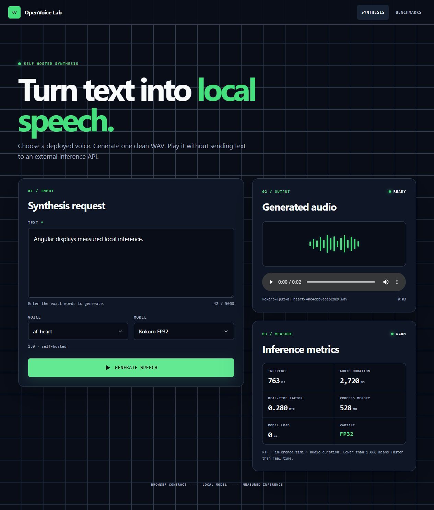
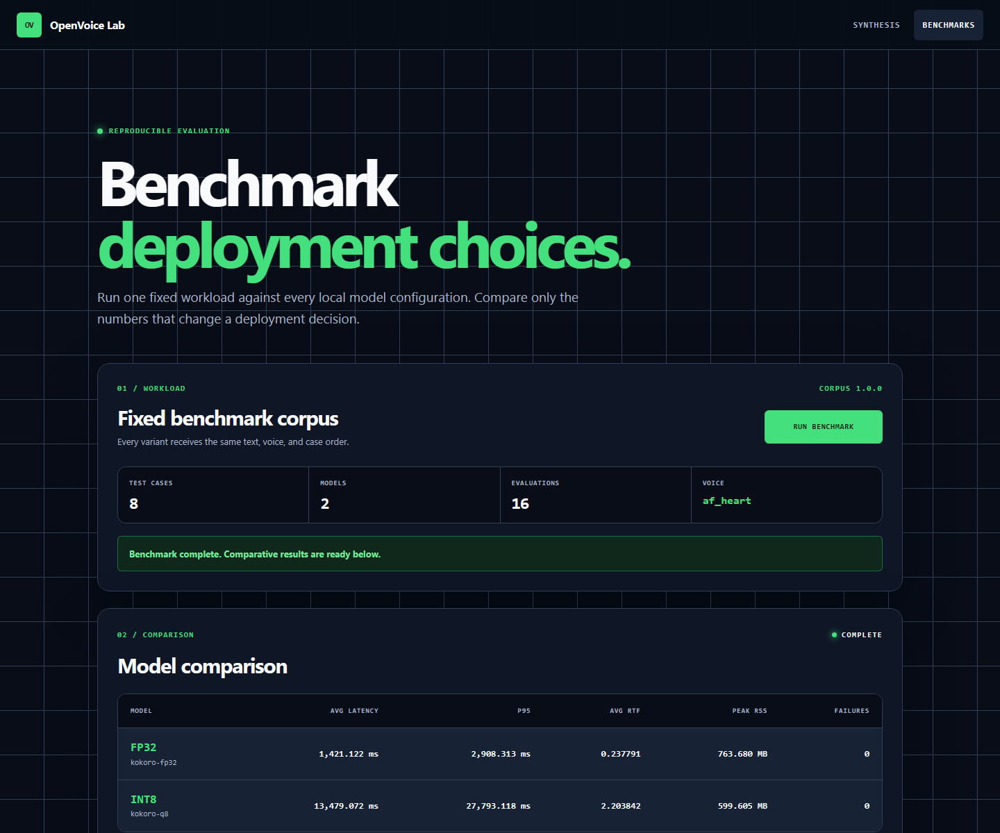

# OpenVoice Lab

**Own the stack. Measure the result.**

OpenVoice Lab evaluates and serves open-weight TTS models through a modular
Angular + FastAPI architecture.

This README is a cumulative build record. New stages extend the story; completed
stages stay visible as evidence of how the system evolved.

## Stage 0 — Architecture-first repository

> “I designed a modular architecture for evaluating and deploying open-weight
> TTS models before implementing the inference system.”

**Responsibility:** establish boundaries before writing inference code.

```text
Angular → REST → FastAPI → SynthesisService → Inference abstraction → Kokoro
```

Stage 0 established the Angular/FastAPI split, replaceable inference port, API
contracts, model-lifecycle ownership, benchmark boundaries, and documentation
conventions. The repository initialized cleanly with every planned module
documented and no runtime claims.

**Portfolio proof:** software architecture and API design.

## Stage 1 — Executable backend contract

> “I converted the architecture into a working FastAPI service while keeping
> inference implementation replaceable.”

**Responsibility:** prove the API boundary before adding AI complexity.

```text
HTTP → FastAPI controller → Pydantic validation → service → typed JSON
```

Stage 1 made `GET /health`, `GET /api/models`, and `POST /api/synthesis`
executable. Synthesis returned deterministic mock data while controllers stayed
limited to HTTP translation, validated schemas, and service calls. Automated
tests covered health, models, valid synthesis, and malformed-input `422` errors.

**Portfolio proof:** FastAPI, Pydantic, API contracts, and service separation.

## Stage 2 — First real open-weight synthesis

> “I replaced the mock implementation with locally hosted open-weight TTS
> inference without changing the API contract.”

| | |
| --- | --- |
| **Model** | Kokoro v1.0 FP32 |
| **Runtime** | ONNX Runtime on the local CPU |
| **Hosting** | Self-hosted |
| **External inference APIs** | None |
| **Current proof** | Text becomes a playable, locally served 24 kHz WAV. |

```text
POST /api/synthesis
  ↓
SynthesisService
  ↓
ModelRegistry → ModelLoader (load once)
  ↓
TTSInferenceEngine
  ↓
KokoroONNXEngine
  ↓
AudioService → generated WAV
```

Controllers still know nothing about Kokoro or ONNX. `ModelLoader` owns the
long-lived runtime session. Repeated identical requests reuse both the loaded
model and a stable request-addressed artifact.

## Stage 3 — Complete synthesis vertical slice

> “I built the first complete user-facing path from Angular input to locally
> hosted AI inference and audio playback.”

**Responsibility:** connect the product path without leaking backend technology
into the browser.

```text
Angular → FastAPI → Kokoro → Audio → Angular player
```

Stage 3 loads model and voice choices from the API, validates text, exposes a
locked loading state, maps backend and inference failures to recovery steps,
and plays the generated WAV in the browser. Angular depends only on the public
request/response contracts—never ONNX sessions, model paths, or Python classes.


**Portfolio proof:** a visitor can use a real full-stack, self-hosted AI product,
not just inspect a backend experiment.

## Stage 4 — Instrument inference performance

> “I added model-level performance instrumentation so inference decisions can
> be based on measurements rather than intuition.”

**Responsibility:** separate model execution from model evaluation.

`MetricsCollector` measures each inference call independently from the engine.
The API and Angular now expose model load time, inference latency, exact audio
duration, RTF, process RSS memory, cold/warm state, and model variant.

Actual warm request measured on the local development machine:

| Measurement | Observed value |
| --- | ---: |
| **Model** | `kokoro-fp32` |
| **Inference** | 676.107 ms |
| **Audio duration** | 2,782.667 ms |
| **RTF** | 0.242971 |
| **Process memory** | 529.816 MB |
| **Model load** | 0.000 ms |
| **Lifecycle state** | Warm |

Mathematical check: `676.107 ÷ 2,782.667 = 0.242971`. Measurements vary by
hardware and workload; these values are recorded output, not benchmark claims.



**Portfolio proof:** the project moves from “I can run AI” to “I can measure AI
systems.”

## Stage 5 — Model registry and inference variants

> “I designed the inference layer so multiple model configurations can be
> evaluated without changing product logic.”

**Responsibility:** make model configuration interchangeable. Keep product logic
out of model selection.

One ID represents one deployable configuration:

| Registry ID | Precision | Why it exists |
| --- | --- | --- |
| `kokoro-fp32` | FP32 | Full-precision baseline for performance and output comparison. |
| `kokoro-q8` | INT8 | Smaller quantized configuration for measuring latency and memory tradeoffs. |

```text
request.modelId
  ↓
ModelRegistry
  ├── kokoro-fp32 → FP32 artifact → cached KokoroONNXEngine
  └── kokoro-q8   → INT8 artifact → cached KokoroONNXEngine
```

There are no model-specific branches in Angular, controllers, or
`SynthesisService`. `/api/models` supplies labels, precision, voices, and stable
IDs; Angular renders that response and sends the chosen ID back. The registry
resolves the artifact and metadata. Switching precision is request data—not a
restart or code change.

Both variants will be benchmarked with the same text, voice, runtime, and
hardware. The comparison will cover load time, inference latency, RTF, process
memory, generated duration, and output quality. Stage 5 does not claim a winner;
it establishes the honest comparison boundary.

**Acceptance proof:** the real integration test synthesizes the same sentence
through both local ONNX variants in one FastAPI process, verifies playable WAVs,
confirms distinct variant metrics, and proves one load per configuration.

**Portfolio proof:** model-serving architecture with interchangeable runtime
configurations—not a one-model integration.

## Stage 6 — Reproducible benchmark system

> “I built an automated evaluation pipeline to compare inference
> configurations using identical workloads.”

**Responsibility:** turn model selection into evidence.

```text
Versioned evaluation cases
  ↓
isolated process per model
  ↓
SynthesisService → metrics → raw case results
  ↓
BenchmarkEvaluator → comparable aggregates
```

The `1.0.0` corpus covers short and medium conversation, long-form text,
numbers, dates, punctuation, questions, and unusual names or words. Every model
receives the same eight case IDs, text, and voice. Each case is retained as a
success or failure; the evaluator calculates average, median, and p95 latency,
average RTF, average and peak process memory, and failure count.

Actual run: `benchmark-2026-08-26T11-02-02-123480Z.json`, Windows 11, Python
3.13.5, 16 logical CPUs, `af_heart`, 8 identical cases per model, 0 failures.
Each model ran in a fresh process so its RSS measurement excludes the other
model. Corpus SHA-256:
`eaf6215e4cf13e670e0b3cfb56f33b6a50939a61e30a2b3296ed7c44d1d9cb98`.

| Variant | Avg latency | P95 latency | Avg RTF | Peak RSS memory |
| --- | ---: | ---: | ---: | ---: |
| FP32 | 1,273.603 ms | 2,571.653 ms | 0.217205 | 766.098 MB |
| Q8 / INT8 | 12,865.738 ms | 25,304.652 ms | 2.151270 | 601.859 MB |

On this CPU/runtime, INT8 reduced peak RSS by 164.239 MB, or 21.4%, but average
latency was about 10.1× higher and slower than real time. I would deploy FP32
for latency-sensitive local synthesis on this machine. Q8 is defensible only
when that memory saving matters more than response time; this single-machine
result is evidence for this environment, not a universal model claim.

Run the complete benchmark with one command:

```powershell
cd backend
.\.venv\Scripts\python.exe -m app.benchmark.runner
```

Raw inputs, measurements, failures, aggregates, corpus hash, and environment
metadata are written to `backend/benchmark-results/`. Runtime result files stay
out of Git; the measured summary above remains the portfolio record.

**Portfolio proof:** a deployment decision backed by identical workloads and
recorded measurements—not intuition.

## Stage 7 — Benchmark dashboard

> “I exposed model-evaluation results through a lightweight product interface
> instead of requiring engineers to inspect raw files.”

**Responsibility:** turn engineering evidence into a product decision surface.

The Angular dashboard loads the fixed workload contract, starts an asynchronous
benchmark job, polls model-level progress, recovers the latest job in a fresh
browser session, reports pipeline failures, and renders the completed FP32/INT8
comparison. FastAPI controllers remain thin; the benchmark job service owns
background execution and the Stage 6 runner still owns evaluation.



The dashboard intentionally exposes only metrics needed for deployment
decisions. Average latency, p95 latency, average RTF, peak process memory, and
failure count remain visible; raw case data and environment metadata stay in the
persisted benchmark result for engineering inspection.

**Portfolio proof:** engineering evaluation and product presentation of the
same evidence, connected through explicit API contracts.

## Run the full stack locally

Once the one-time setup below is complete, start both servers from the repository
root:

```powershell
.\start.ps1
```

The launcher checks the virtual environment, frontend dependencies, and local
model artifacts before opening the backend and frontend server processes. Run
`.\start.ps1 -CheckOnly` to validate prerequisites without starting anything.

Backend:

```powershell
cd backend
py -3 -m venv .venv
.\.venv\Scripts\python.exe -m pip install -e ".[dev]"
.\.venv\Scripts\python.exe scripts\download_models.py
.\.venv\Scripts\uvicorn.exe app.main:app --reload
```

Model binaries are downloaded from the upstream release, checksum-verified,
and excluded from Git. See [artifact provenance](backend/model-artifacts/README.md).

Frontend (second terminal):

```powershell
cd frontend
npm ci
npm start
```

Open `http://localhost:4200`. The development proxy keeps `/api` and generated
`/audio` requests on the same documented browser contract.

## Verified request → audio

```text
curl -X POST http://localhost:8000/api/synthesis \
  -H "Content-Type: application/json" \
  -d '{"text":"OpenVoice Lab is running locally.","modelId":"kokoro-fp32","voiceId":"af_heart"}'
  ↓
{"status":"ok","model":"kokoro-fp32","text":"OpenVoice Lab is running locally.","audioUrl":"/audio/kokoro-fp32-af_heart-27561063304ff41f.wav"}
```

Result: `kokoro-fp32-af_heart-27561063304ff41f.wav`

The automated suite verifies both real model variants, playable WAVs, useful API
errors, stable output, warm reuse, and one load per configuration:

```powershell
.\.venv\Scripts\pytest.exe -q
# 18 passed
```

The Angular suite covers dynamic variant discovery and selection, empty input,
the locked loading state, backend unavailability, inference failure, and
successful audio delivery:

```powershell
cd frontend
npm test
# 14 passed
```

## Boundaries and roadmap

- [Architecture](docs/ARCHITECTURE.md)
- [Module responsibilities](docs/MODULES.md)
- [API contract](docs/API.md)
- [Iterative coding map](docs/ITERATIVE_CODING_MAP.md)

**Portfolio status:** this repository now demonstrates a measured, multi-variant
TTS product and evaluation system: Angular synthesis and benchmark interfaces,
FastAPI orchestration, self-hosted open-weight inference, registry-owned
lifecycle, generated audio, mathematically verified instrumentation, a
reproducible benchmark, and a browser-visible deployment comparison.
